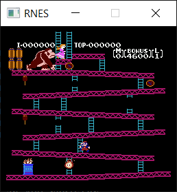
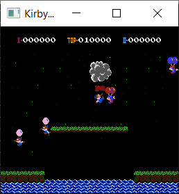

# RNES

  
  

## Resources
- [MOS MCS6500 Programming Manual](http://users.telenet.be/kim1-6502/6502/proman.html)
- [Nesdev Wiki](http://wiki.nesdev.com/w/index.php/Nesdev_Wiki)
- [Nocash NES Specs](http://problemkaputt.de/everynes.htm)
