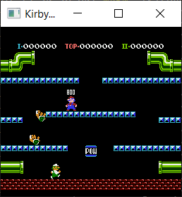

# KirbyNES

## Building and running
`cargo run --release <rom path>`

## Controls
| NES | Key (AZERTY) |
| --- | --- |
| A | A |
| B | Z |
| D-Pad | Arrows |
| Start | Enter |
| Select | Space |

## Screenshots

  
  
  

## Resources
- [MOS MCS6500 Programming Manual](http://users.telenet.be/kim1-6502/6502/proman.html)
- [Nesdev Wiki](http://wiki.nesdev.com/w/index.php/Nesdev_Wiki)
- [Nocash NES Specs](http://problemkaputt.de/everynes.htm)
